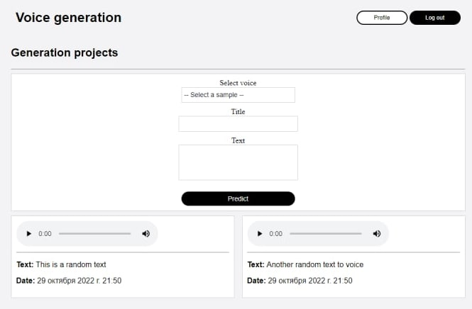
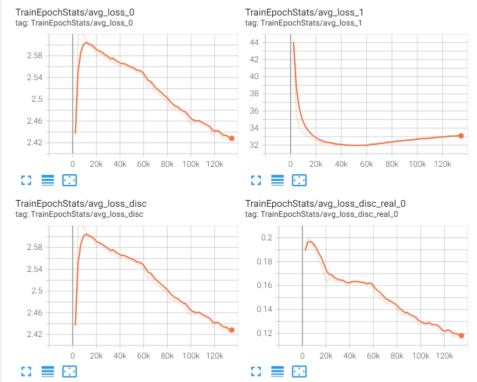
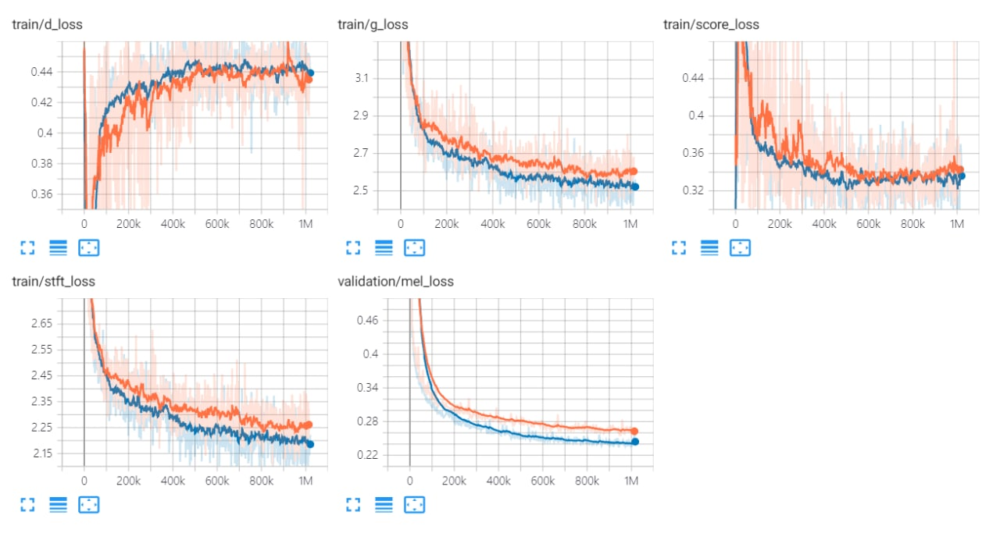
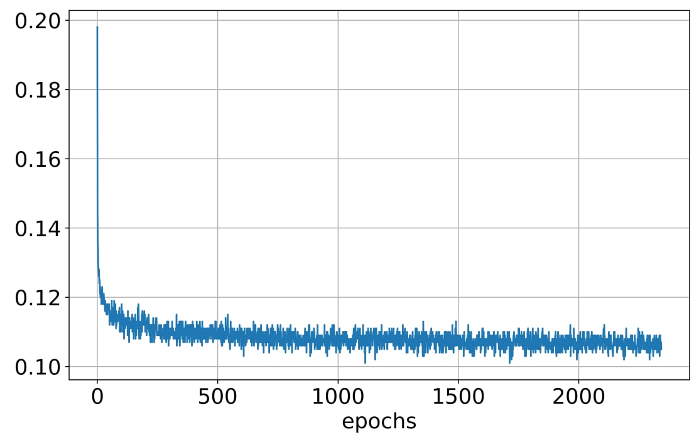

# Voice Generation project

## Постановка задачи

Собрать данные, обучить модель синтеза речи на русском языке и разработать веб-сервис и веб-интерфейс для использования модели.

## Данные и их сбор

Данные имеют вид пар семплов речи с текстовой транскрибцией.

Сбор производился автоматическими инструментами нарезки по тишине по 5-12 секунд, распознаванием речи, расстановки пунктуации.

## Подготовка окружения
```
cd generation
docker built -t generation .
docker-compose up
```
## Производительность и необходимое оборудование
Для инференса подойдет CPU. Ryzen 5600h: ~1200 символов в минуту

Для обучения рекомендуется использовать NVIDIA GPU c 16GB VRAM и более. 

Меньше VRAM -> меньше батч сайз -> ниже качество (генерализация) и скорость обучения

## Масштабирование
Решение можно масштабировать: создать оркестр воркеров с помощью, например, kubernetes, и распределенную очередь
## Метрики
Выбраны метрики 

VITS - discriminator loss, generator loss
FastPitch + Univnet - discriminator loss, generator loss, mel loss, vocoder loss
Grad TTS - Prior Loss

## Выбранная модель
По метрикам и аудиовосприятию лучшей моделью избран VITS
## Лог экспериментов

## VITS 

## FastPitch + Univnet

## GradTTS
